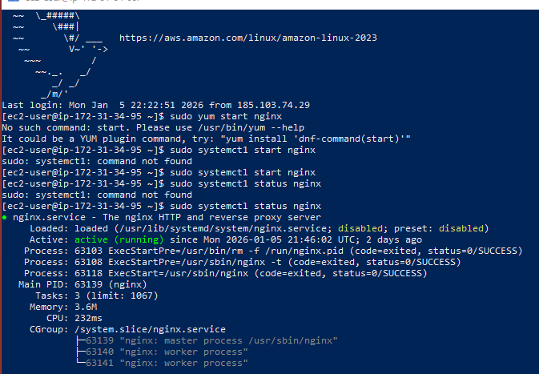
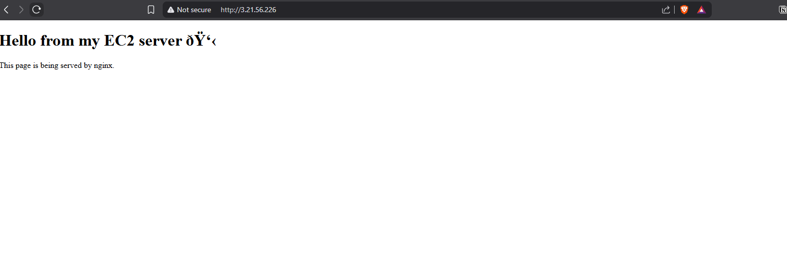

# cloud-learning

# Cloud Learning – Week 1 (Linux & EC2)

## Overview
This repository documents my Week 1 cloud learning, focused on Linux fundamentals and deploying a basic web server on AWS EC2.

The goal was to understand how servers work at a low level, including SSH access, package management, networking, and serving web content.

---

## What I did

- Launched a free-tier AWS EC2 instance (Amazon Linux)
- Connected to the server using SSH from Windows PowerShell
- Learned basic Linux navigation and file operations
- Installed software using the system package manager (`yum`)
- Installed and ran the nginx web server
- Configured AWS security groups to allow HTTP traffic on port 80
- Created and served a custom static HTML page

---

## Key concepts learned

- Difference between local machine and remote server
- SSH and port 22
- HTTP vs HTML
- What ports are and how services listen on them
- What a security group is and why ports must be opened
- How nginx serves files in response to HTTP requests

---

## Technologies used

- AWS EC2
- Amazon Linux
- nginx
- SSH
- Linux CLI

---

## Result

The EC2 instance successfully serves a custom HTML page via its public IP address using nginx.

Screenshots below show:
- nginx running as a system service
- the web page being served in a browser

## Screenshots

### nginx running on EC2

### Web page served from EC2

## Cloud Learning – Week 2 (Networking Fundamentals)

### Overview
Week 2 focused on understanding how network traffic reaches a server, how web requests are processed, and how to diagnose connectivity issues in a cloud environment.

The emphasis was on learning how to verify each layer of the network stack (DNS, IP addressing, ports, and services) and how to troubleshoot common access problems.

---

### What I did
- Learned the difference between IP addresses and domain names
- Understood how DNS resolves a domain name to an IP address
- Studied the HTTP request lifecycle from browser to server and back
- Learned the purpose of common ports (22, 80, 443)
- Used `curl` to test HTTP endpoints from the command line
- Verified connectivity using both domain names and raw IP addresses
- Modified EC2 security group rules to allow and block traffic
- Intentionally broke HTTP access by removing port 80 and restored it
- Diagnosed issues by testing locally on the server versus externally

---

### Key concepts learned
- DNS resolution (browser → resolver → authoritative DNS)
- Endpoints as a combination of IP/domain, port, and service
- Difference between application-level issues and network-level issues
- How security groups control inbound traffic to EC2 instances
- How to isolate failures using `curl`, `nslookup`, and SSH
- Why a service can work locally but be unreachable from the internet

---

### Technologies & tools used
- AWS EC2
- Amazon Linux
- nginx
- SSH
- `curl`
- PowerShell
- Linux networking tools

---

### Result
The EC2 instance is reachable via HTTP from the public internet.

I am able to verify DNS resolution, test endpoints using `curl`, and diagnose connectivity issues by identifying whether failures occur at the application, operating system, or AWS networking layer.

## Cloud Learning – Week 3 (Git & GitHub)

### Overview
Week 3 focused on using Git and GitHub as core tools for managing work, tracking progress, and maintaining a clear history of changes while learning cloud and automation concepts.

The emphasis was on treating learning like a real technical project by using version control consistently rather than as a final step.

---

### What I did
- Cloned repositories and worked locally using Git
- Tracked changes using `git add`, `git commit`, and `git push`
- Created and switched between branches to separate work logically
- Merged branches back into the main branch
- Resolved merge conflicts manually
- Practised writing clear and meaningful commit messages
- Pushed work to GitHub regularly
- Used GitHub Issues to track tasks and learning goals

---

### Key concepts learned
- Difference between local repositories and remote repositories
- Why frequent, small commits are preferable to large commits
- How branching supports parallel work and experimentation
- How and why merge conflicts occur
- How commit history communicates progress and intent
- Using GitHub as both a version control platform and a task-tracking tool

---

### Technologies & tools used
- Git
- GitHub
- GitHub Issues
- Command line (PowerShell and Linux CLI)

---

### Result
The repository maintains a clean, readable commit history that reflects continuous progress.

All work across multiple weeks is tracked and versioned correctly, demonstrating a structured and professional workflow similar to real-world software and cloud projects.

## Cloud Learning – Week 4 (Python Automation & EC2)

### Overview
Week 4 focused on using Python as an automation tool rather than just a local programming language.

The goal was to understand how Python scripts interact with external services, process real data, and run on a remote cloud server. This week connected Python fundamentals with cloud infrastructure by running scripts on an AWS EC2 instance.

---

### What I did
- Wrote Python scripts using functions and a modular structure
- Created and used Python virtual environments to isolate dependencies
- Installed third-party libraries using `pip`
- Used the `requests` library to call public HTTP APIs
- Parsed JSON responses returned by APIs
- Implemented basic error handling for HTTP requests
- Saved API output to files for persistence
- Ran Python scripts on an Amazon Linux EC2 instance via SSH

---

### Key concepts learned
- Difference between local Python execution and remote execution on a server
- How virtual environments isolate Python dependencies per project
- How HTTP APIs return structured JSON data
- How to check and handle HTTP response status codes
- Why file paths differ between Windows and Linux environments
- How Python scripts can be used for automation tasks on cloud servers

---

### Technologies & tools used
- Python 3
- `requests`
- Virtual environments (`venv`)
- AWS EC2
- Amazon Linux
- SSH

---

### Result
A Python script successfully runs on an EC2 instance, retrieves data from a public API, and saves the output to a file on the server.

This demonstrates a complete automation workflow:
- Remote execution
- External data retrieval
- Error handling
- Persistent output

# Cloud Learning – Week 5 (IAM, S3 & Reverse Proxy Architecture)

## Overview
Week 5 focused on securely integrating multiple AWS services to build a real end-to-end web application.

The goal was to understand how a public-facing website can display content stored in a **private Amazon S3 bucket** by using IAM roles, a backend API, and nginx as a reverse proxy, without exposing storage to the public internet.

This week brought together Linux, networking, Python automation, and AWS security concepts into a single working system.

---

## What I did

- Created a private Amazon S3 bucket to store image files
- Attached an IAM role to the EC2 instance with least-privilege S3 permissions
- Wrote a Python script to upload images to S3 using the EC2 IAM role
- Used structured S3 object paths (`dogs/breed/<breed>/<timestamp>.jpg`)
- Built a Flask API running locally on the EC2 instance
- Generated pre-signed URLs for private S3 objects using boto3
- Installed and configured nginx as a reverse proxy
- Configured nginx to proxy `/api/*` requests to the Flask application on `127.0.0.1:5000`
- Served a static HTML page using nginx that fetches image data from the API
- Debugged nginx configuration errors and server block conflicts
- Verified access locally and via the EC2 public IP address

---

## Key concepts learned

- IAM roles vs long-lived access keys on EC2
- Difference between bucket-level and object-level S3 permissions
- Why S3 buckets should remain private by default
- How pre-signed URLs provide temporary access to private objects
- Difference between serving static files and reverse proxying requests
- nginx server blocks, location matching, and `default_server` precedence
- How to debug issues across multiple layers (browser, nginx, backend, AWS services)

---

## Technologies used

- AWS EC2
- Amazon S3
- AWS IAM (roles and policies)
- nginx
- Python (boto3, requests, Flask)
- Linux CLI
- curl

---

## Result

A fully working web application accessible via a public EC2 IP address that displays images stored in a **private S3 bucket**, using pre-signed URLs and a reverse-proxy architecture.

This demonstrates secure cloud design principles and real-world service integration without making storage publicly accessible.

---

## Screenshots

Screenshots below show:
- The web gallery served via nginx
- Images loaded from private S3 using pre-signed URLs
- nginx successfully proxying API requests

